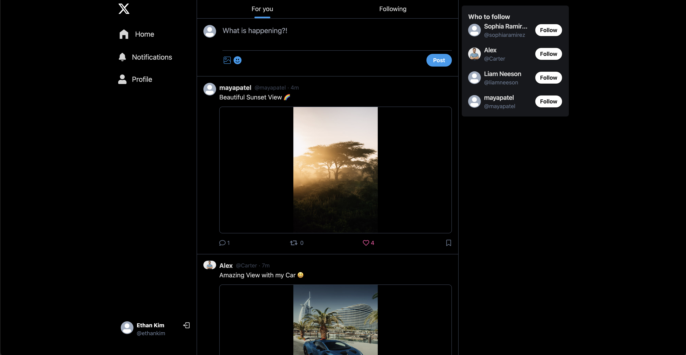
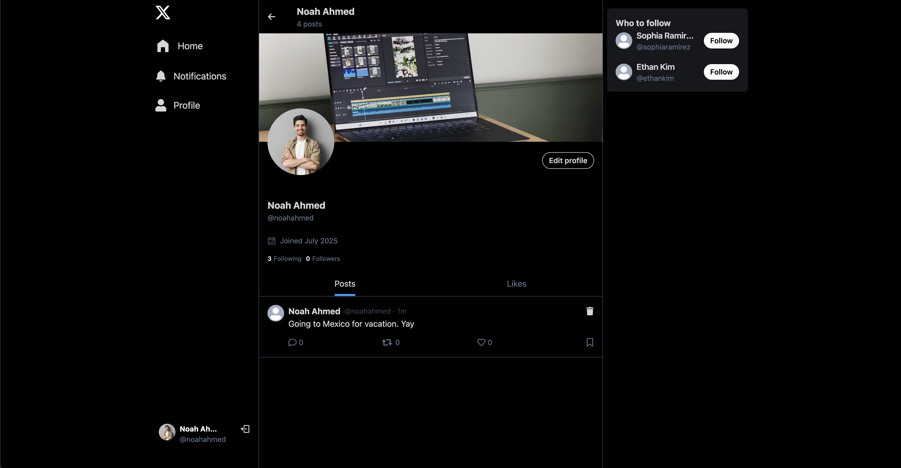
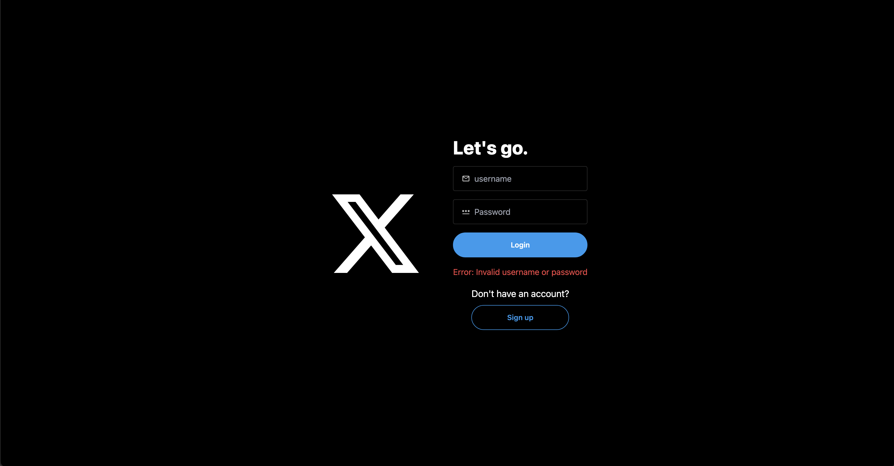
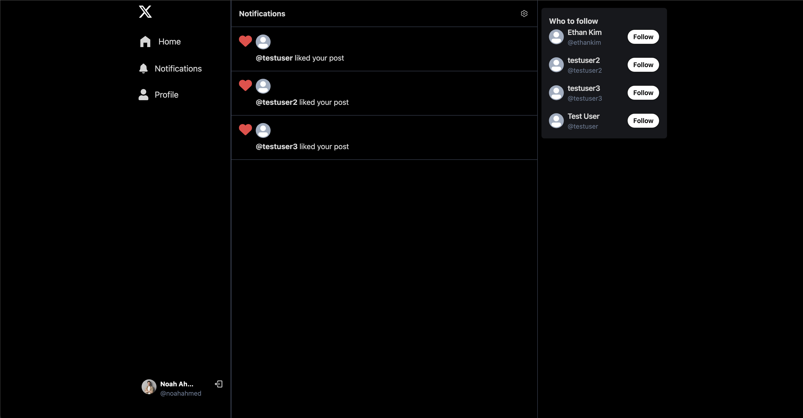

# Twitter Clone - Full Stack MERN Application

A full-featured Twitter clone built with the MERN stack (MongoDB, Express.js, React.js, Node.js) featuring real-time interactions, image uploads, and modern UI design.

## 📸 Screenshots

<div align="center">
  
  <p><strong>Main Feed</strong> - Clean Twitter-like interface with posts, user interactions, and navigation sidebar</p>
</div>

<div align="center">
  
  <p><strong>User Profile</strong> - Complete profile page with cover image, profile picture, user stats, and posts grid</p>
</div>

<div align="center">
  
  <p><strong>Authentication</strong> - Modern login interface with clean design and form validation</p>
</div>

<div align="center">
  
  <p><strong>Notifications</strong> - Real-time notification system for user activities and interactions</p>
</div>

## ✨ Features

### 🔐 Authentication & User Management

- JWT-based authentication system
- User registration and login
- Secure password hashing with bcrypt
- Protected routes and middleware

### 📱 Social Features

- **Post Management**: Create, edit, and delete posts
- **Interactions**: Like and unlike posts
- **Comments**: Add and manage comments on posts
- **User Following**: Follow/unfollow other users
- **User Suggestions**: Discover new users to follow

### 🎨 Profile & Media

- **Profile Management**: Edit profile information
- **Image Uploads**: Profile pictures and cover images via Cloudinary
- **Real-time Updates**: Instant UI updates with React Query

### 🔔 Notifications

- Real-time notification system
- Activity tracking for likes, comments, and follows

### 🎯 Technical Features

- **Responsive Design**: Mobile-first approach with Tailwind CSS
- **Modern UI**: Beautiful interface with DaisyUI components and dark theme
- **Performance**: Optimized with React Query for caching and real-time updates
- **Image Optimization**: Cloudinary integration for profile pictures and post images
- **Real-time Interactions**: Instant updates for likes, comments, and follows

## 🛠️ Tech Stack

### Frontend

- **React.js** - UI framework
- **Vite** - Build tool and dev server
- **Tailwind CSS** - Utility-first CSS framework
- **DaisyUI** - Component library
- **React Query** - Data fetching and caching
- **React Router** - Client-side routing
- **React Icons** - Icon library
- **React Hot Toast** - Notifications

### Backend

- **Node.js** - Runtime environment
- **Express.js** - Web framework
- **MongoDB** - NoSQL database
- **Mongoose** - MongoDB ODM
- **JWT** - Authentication tokens
- **bcryptjs** - Password hashing
- **Cloudinary** - Image upload and management
- **Cookie Parser** - Cookie handling
- **CORS** - Cross-origin resource sharing

## 📦 Installation & Setup

### Prerequisites

- Node.js (v16 or higher)
- MongoDB (local or Atlas)
- Cloudinary account

### 1. Clone the Repository

```bash
git clone https://github.com/yourusername/twitter-clone.git
cd twitter-clone
```

### 2. Install Dependencies

```bash
# Install backend dependencies
npm install

# Install frontend dependencies
cd frontend
npm install
cd ..
```

### 3. Environment Configuration

Create a `.env` file in the root directory:

```env
MONGO_URI=your_mongodb_connection_string
PORT=5001
JWT_SECRET=your_jwt_secret_key
NODE_ENV=development
CLOUDINARY_CLOUD_NAME=your_cloudinary_cloud_name
CLOUDINARY_API_KEY=your_cloudinary_api_key
CLOUDINARY_API_SECRET=your_cloudinary_api_secret
```

### 4. Database Setup

- Create a MongoDB database (local or Atlas)
- Update the `MONGO_URI` in your `.env` file

### 5. Cloudinary Setup

- Sign up at [Cloudinary](https://cloudinary.com/)
- Get your cloud name, API key, and API secret
- Update the Cloudinary variables in your `.env` file

## 🚀 Running the Application

### Development Mode

```bash
# Start backend server (runs on port 5001)
npm run dev

# In a new terminal, start frontend (runs on port 3000)
cd frontend
npm run dev
```

### Production Mode

```bash
# Build the application
npm run build

# Start production server
npm start
```
